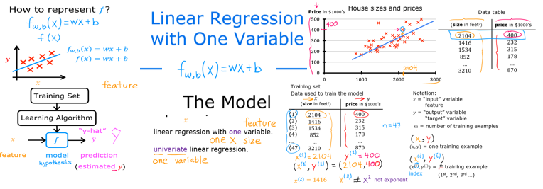

# Machine Learning

>[!Note]
>This course starts from beginner and basics of ML and covers upto Intermediate level concepts.

#### So, **What is machine learning** ?
A field of study that gives the computers an ability to learn without being explicitly programmed.

#### **Types of Machine Learning:**
1. **Supervised Learning**
2. **Unsupervised Learning**
3. **Recommender Systems.**
4. **Reinforcement learning.**

### Terminology

- **Training Set -** Data set used to train the model $`_{targets}^{features}`$
- **Feature -** Standard notation to denote the input variable `x` in a data set.
- **target -** Standard notation to denote the output variable `y` in a data set.
- ***`m` -*** Number of training Examples (e.g. rows in a data set).
- ***$`(x^{(i)},y^{(j)})`$*** - Denotes the $i^{th}$ Feature and $j^{th}$ target of the training set as a training example (Basically used to denote the Feature and Target set being used as a training example).
    > Note: ***$`x^{2}`$*** does not mean ***square of `x`***, instead it means ***$`2^{nd}`$ Feature*** of the training set.
- ***$`f`$*** - Called the **Model** is the $Function$, that is produced after the training set data is fed into the Supervised training algorithm.
- ***$`\hat{y}`$*** - **Prediction** that was produced from the function $f$ for input of $x$.


## Supervised Learning

Supervised learning is a type of machine learning where the model is trained on a labeled dataset. In this dataset, each input comes with a corresponding output or label. The model learns to map inputs to the correct outputs by finding patterns and relationships in the data. Once trained, the model can make predictions on new, unseen data.
In supervised learning the ML Algorithm is given an imput `x` and for every input of x a right answer or output of `y` is given. The ML Algorithm then tries to find out relationships and patterns so that for every new input `x` it can produce the correct output.

**Types:**
1. Regression
2. Classification

---

### 1. Regression

>[!Tip]
>In these types of models the predictions or outputs `y` can be infinite.

The model has to output a number after analyzing the input, it may produce infinitely possible outcomes.
Regression is a type of supervised learning used in machine learning and statistics to predict a continuous outcome variable based on one or more predictor variables. The goal of regression is to model the relationship between the dependent variable (the outcome we want to predict) and the independent variables (the predictors). Infinitely many outputs `y` that are possible are predicted.

#### Linear Regression (Univariate Linear Regression)

Linear regression is a statistical method used to model the relationship between a dependent variable and one or more independent variables by fitting a linear equation to observed data. Using a single variable or input here in the regression model.
For the number of inputs `x` there should be the same number of outputs `y` in the sample data.

>[!Note]
> **Model $f$** ->  **$f_{w,b}$(x) = $wx+b$**, When $f$ is a straight line.

>[!Tip]
> $f$ is the function that makes prediction  **$`\hat{y}`$** based on **$_{w,b}$** which are numbers for the input feature $`x`$. <br>
>**Alternatively** or simply $f(x)$ = $wx+b$.



**Model :** 

$$f_{w,b}(x^{(i)}) = wx^{(i)} + b$$


**Cost Function :** 

$$J_{(w,b)} = \frac{1}{2m}\sum_{i=0}^m (f_w,_b(x^{(i)})-y^{(i)})$$


**Gradient Descent:**

$$w = w - \alpha.\frac{\partial }{\partial w}J_{(w,b)}$$

$$b = b - \alpha.\frac{\partial }{\partial b}J_{(w,b)}$$


**Alternatively,**

$$w = w - \alpha . [\frac{1}{m}\sum_{i=0}^m (f_w,_b(x^{(i)})-y^{(i)}).x^{(i)}]$$

$$b = b - \alpha . [\frac{1}{m}\sum_{i=0}^m (f_w,_b(x^{(i)})-y^{(i)})]$$


**Finally,**

> $$w = w - \alpha . [\frac{1}{m}\sum_{i=0}^m ((w.x^{(i)} +b )-y^{(i)}).x^{(i)}]$$
>
> $$b = b - \alpha . [\frac{1}{m}\sum_{i=0}^m ((w.x^{(i)} +b )-y^{(i)})]$$
>


---


### 2. Classification

>[!Tip]
>This model will only have specific outputs. These outputs will be labelled/Classified 
Model will only have Specific outputs. These outputs will be labelled/Classified into classification.

Note:

```
Table
Size     : CM
Diagnosis: Malignant (1) or Benign (0)
+---------------+-----------+
| Size (x)      | Diagnosis |
|               |   (y)     |
|---------------|-----------|
|   2           |   0       |
|   5           |   1       |
|   1           |   0       |
|   7           |   1       |
+---------------+-----------+
```

>The table above shows the data for patients being diagnosed for breast cancer with lumps in cms,the resulting diagnosis that was done for each of these sizes. 
>The Diagnosis is either Benign or Malignant - These will be our classification, now according to the inputs in size our **ML model will be able to predict whether the diagnosis will be either of these two classifications**


- In classification the terms ***class*** and ***category*** are used interchangeably.
- More than one inputs can be used. 


---

## *Un*supervised Learning
>[!Tip]
> The Algoritm is allowed to figure out useful or interesting data on its own from a given data set,
> we are not expecting it to have correct/specific answers by labelling the data and supervising it.

Also caused clustering, is a type of lerning algorithms which is not provided with **labelling** of the outputs `y` for every inputs `x` like it was the case for supervised learning algorithms.
In this case the algorithm is allowed to learn or figure out on its own ***something interesting*** from a given data set. Since the data set isn't properly labelled the algoritm may try to come up with any relations that it can find in order to group the datas into **clusters**.

**Types**
1. Clustering - Group similar data together.
2. Anomaly Detection - Find unusual data points.
3. Dimensionality Reduction - Compress data using fewer numbers.

